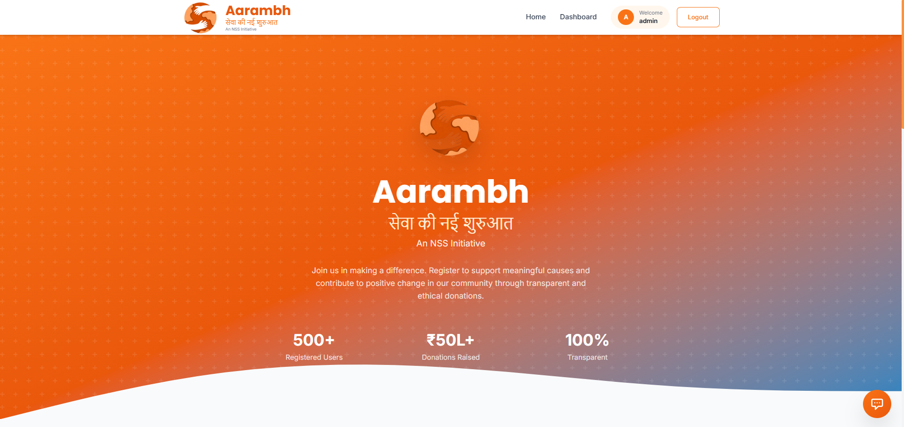
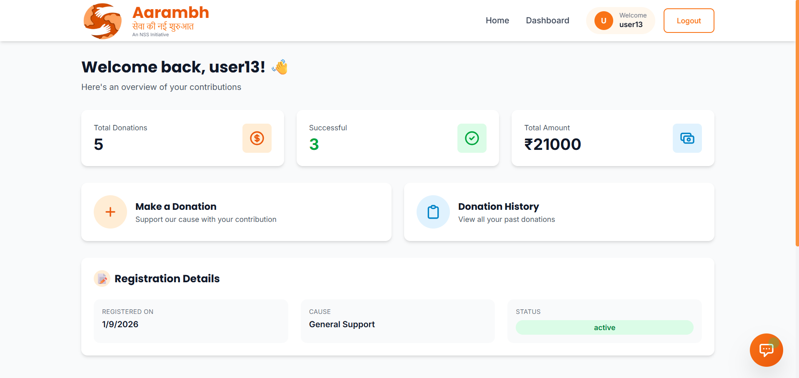
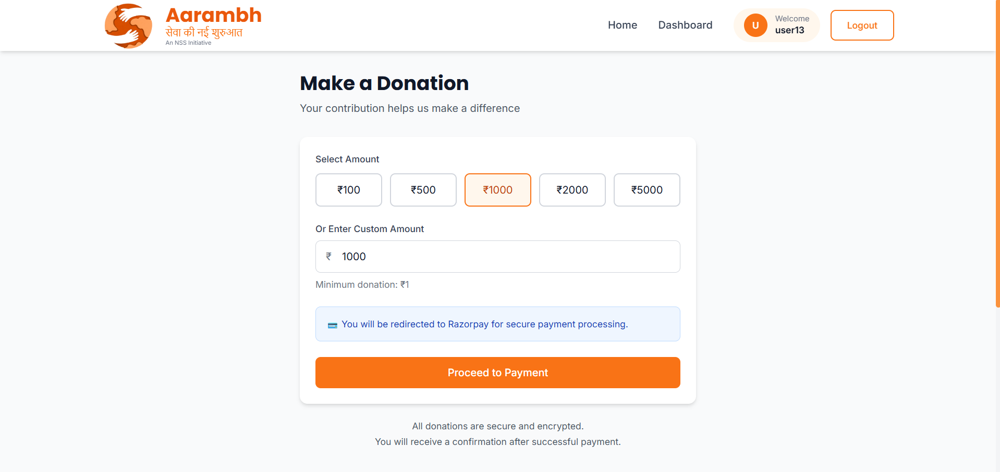
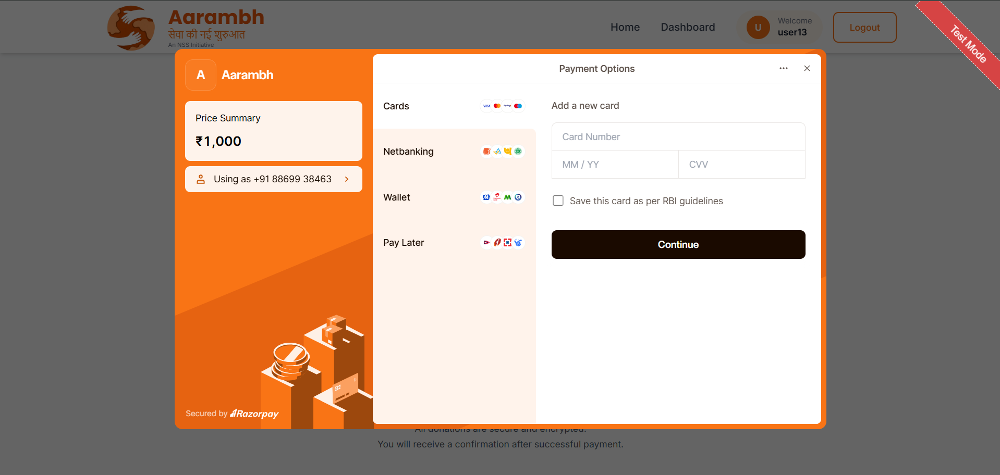
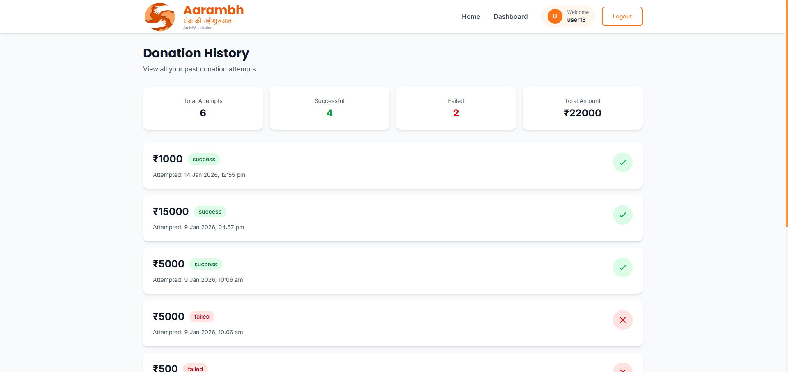
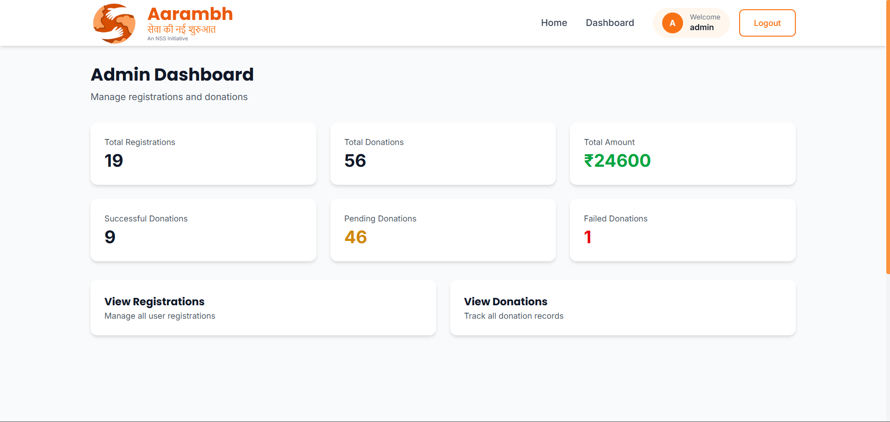

# Aarambh - NGO Registration & Donation Management System

<div align="center">


**सेवा की नई शुरुआत** - *A New Beginning of Service*

An NSS Initiative to revolutionize NGO donation management with transparency and data integrity.

[](https://aarambh12.netlify.app/)
[](https://ngo-management-system-b03m.onrender.com)
[](https://github.com/Rahul1227/ngo-management-system)

</div>

---

## 🎯 Problem Statement

NGOs often lose user data when donations aren't completed, and administrators lack visibility into registrations. **Aarambh** solves this by:

- ✅ Saving registration data **independently** of donation completion
- ✅ Tracking **all donation attempts** (success/pending/failed)
- ✅ Providing **complete transparency** in donation history
- ✅ Offering **comprehensive admin dashboard** for monitoring
- ✅ Ensuring **ethical payment handling** with Razorpay verification

---

## ✨ Key Features

### 🔐 Authentication & Security
- Role-based access control (User/Admin)
- JWT-based authentication
- Secure password hashing with bcrypt

### 👤 User Features
- **Registration System** - Data saved immediately, independent of donations
- **Flexible Donations** - Donate any amount via secure Razorpay integration
- **Complete Transparency** - View all donation attempts (success/pending/failed)
- **Donation History** - Track every payment with timestamps and status
- **AI Chatbot** - Get instant answers about Aarambh, NSS, and sewa

### 👨‍💼 Admin Features
- **Analytics Dashboard** - View total registrations, donations, and statistics
- **User Management** - View all registered users with filtering
- **Donation Monitoring** - Track all payments with status updates
- **Data Export** - Export registrations and donations as CSV
- **Activity Logs** - Track admin actions for transparency

### 🎨 Design & UX
- Fully responsive (mobile, tablet, desktop)
- Modern UI with Tailwind CSS v4
- Smooth animations and transitions
- Real-time loading indicators
- Informative popups for slow server startup (Render free tier)

---

## 🛠️ Tech Stack

| Layer | Technology |
|-------|-----------|
| **Frontend** | React.js, Tailwind CSS v4, React Router, Axios |
| **Backend** | Node.js, Express.js, JWT, bcrypt |
| **Database** | MongoDB Atlas |
| **Payment** | Razorpay (Test Mode) |
| **AI Chatbot** | Google Gemini / OpenRouter |
| **Hosting** | Frontend: Netlify, Backend: Render |

---

## 🔑 Test Credentials

### Admin Access
```
Email: admin@gmail.com
Password: admin123
```

### User Access
```
Email: user13@gmail.com
Password: rahulyadav
```

### Razorpay Test Cards
```
Success:
Card: 4111 1111 1111 1111
CVV: Any 3 digits
Expiry: Any future date

Failure:
Card: 4000 0000 0000 0002
CVV: Any 3 digits
Expiry: Any future date
```

---

## 📸 Screenshots

### 🏠 Landing Page

*Hero section with Aarambh branding, features showcase, and about NSS section*

### 📊 User Dashboard

*User dashboard showing registration details, donation statistics, and quick actions*

### 💰 Donation Form

*Simple donation interface with quick amount buttons and Razorpay integration*

### 💳 Payment Gateway

*Secure Razorpay payment modal for processing donations*

### 📜 Donation History

*Complete donation history with status badges (success/pending/failed)*

### 🎛️ Admin Dashboard

*Admin panel with statistics cards, user management, and donation tracking*

---

## 🚀 Quick Start

### Prerequisites
```bash
Node.js v16+
MongoDB Atlas account
Razorpay test account
```

### Installation

```bash
# Clone repository
git clone https://github.com/Rahul1227/ngo-management-system.git
cd ngo-management-system

# Install backend dependencies
cd backend
npm install

# Install frontend dependencies
cd ../frontend
npm install
```

### Environment Variables

**Backend (`backend/.env`):**
```env
PORT=5000
MONGO_URI=your_mongodb_atlas_connection_string
JWT_SECRET=your_super_secret_jwt_key
JWT_EXPIRE=7d
RAZORPAY_KEY_ID=your_razorpay_test_key_id
RAZORPAY_KEY_SECRET=your_razorpay_test_key_secret
FRONTEND_URL=http://localhost:3000
```

**Frontend (`frontend/.env`):**
```env
VITE_API_URL=http://localhost:5000
VITE_RAZORPAY_KEY_ID=your_razorpay_test_key_id
VITE_OPENROUTER_API_KEY=your_openrouter_api_key
```

### Run Locally

```bash
# Terminal 1 - Run backend (from backend folder)
npm run dev
# Backend runs on: http://localhost:5000

# Terminal 2 - Run frontend (from frontend folder)
npm run dev
# Frontend runs on: http://localhost:5173
```

---

## 📁 Project Structure

```
ngo-management-system/
├── backend/
│   ├── config/
│   │   └── db.js                 # MongoDB connection
│   ├── controllers/
│   │   ├── authController.js     # Authentication logic
│   │   ├── userController.js     # User operations
│   │   ├── donationController.js # Donation & payment
│   │   └── adminController.js    # Admin operations
│   ├── models/
│   │   ├── User.js               # User schema
│   │   ├── Registration.js       # Registration schema
│   │   ├── Donation.js           # Donation schema
│   │   └── AdminLog.js           # Admin activity logs
│   ├── routes/
│   │   ├── authRoutes.js
│   │   ├── userRoutes.js
│   │   ├── donationRoutes.js
│   │   └── adminRoutes.js
│   ├── middleware/
│   │   ├── auth.js               # JWT verification
│   │   ├── roleCheck.js          # Role-based access
│   │   └── errorHandler.js       # Error handling
│   └── server.js                 # Entry point
│
├── frontend/
│   ├── src/
│   │   ├── components/
│   │   │   ├── common/           # Reusable components
│   │   │   ├── auth/             # Login, Register
│   │   │   ├── user/             # User dashboard
│   │   │   ├── admin/            # Admin dashboard
│   │   │   └── landing/          # Landing page
│   │   ├── context/
│   │   │   └── AuthContext.jsx   # Global auth state
│   │   ├── services/
│   │   │   ├── api.js            # Axios config
│   │   │   ├── authService.js
│   │   │   ├── userService.js
│   │   │   ├── donationService.js
│   │   │   └── adminService.js
│   │   ├── hooks/
│   │   │   ├── useAuth.js
│   │   │   └── useRazorpay.js
│   │   └── pages/                # Page components
│   └── public/
│       └── assets/images/        # Logo and images
│
└── docs/
    └── screenshots/              # Project screenshots
        ├── landing-page.png
        ├── user-dashboard.png
        ├── donation-form.png
        ├── payment-gateway.png
        ├── donation-history.png
        └── admin-dashboard.png
```

---

## 🔑 Key Design Decisions

1. **Separation of Concerns**: Registration and Donation are independent MongoDB collections
   - User data is **never lost**, even if payment fails
   - All donation attempts are tracked with status

2. **Payment Verification**: 
   - Donations marked successful **only after** Razorpay signature verification
   - No fake or forced payment success logic
   - Failed/pending payments clearly recorded

3. **Security**:
   - JWT-based authentication with HTTP-only considerations
   - Password hashing with bcrypt (10 salt rounds)
   - Role-based access control (User/Admin)
   - Protected API routes with middleware

4. **Data Integrity**:
   - MongoDB indexes for faster queries
   - Timestamps on all records
   - Admin activity logging for transparency

5. **User Experience**:
   - Loading popup explains Render free tier cold start (30-60 seconds)
   - Real-time donation status updates
   - AI chatbot for instant support
   - Responsive design for all devices

---

## 🌐 API Endpoints

### Authentication
| Method | Endpoint | Description | Access |
|--------|----------|-------------|--------|
| POST | `/api/auth/register` | Register new user | Public |
| POST | `/api/auth/login` | Login user/admin | Public |
| GET | `/api/auth/me` | Get current user | Private |

### User Routes
| Method | Endpoint | Description | Access |
|--------|----------|-------------|--------|
| GET | `/api/user/profile` | Get user profile & registration | Private (User) |
| GET | `/api/user/donations` | Get donation history | Private (User) |

### Donation Routes
| Method | Endpoint | Description | Access |
|--------|----------|-------------|--------|
| POST | `/api/donations/create` | Create donation & Razorpay order | Private (User) |
| POST | `/api/donations/verify` | Verify payment signature | Private (User) |
| POST | `/api/donations/webhook` | Razorpay webhook handler | Public |

### Admin Routes
| Method | Endpoint | Description | Access |
|--------|----------|-------------|--------|
| GET | `/api/admin/dashboard` | Get dashboard statistics | Private (Admin) |
| GET | `/api/admin/registrations` | Get all registrations | Private (Admin) |
| GET | `/api/admin/donations` | Get all donations | Private (Admin) |
| GET | `/api/admin/export/registrations` | Export registrations CSV | Private (Admin) |
| GET | `/api/admin/export/donations` | Export donations CSV | Private (Admin) |

---

## 📊 Database Schema

### Users Collection
```javascript
{
  _id: ObjectId,
  email: String (unique),
  password: String (hashed),
  fullName: String,
  phone: String,
  role: "user" | "admin",
  createdAt: Date,
  updatedAt: Date
}
```

### Registrations Collection (Independent)
```javascript
{
  _id: ObjectId,
  userId: ObjectId (ref: User),
  registrationDate: Date,
  causeName: String,
  status: "active" | "inactive",
  createdAt: Date
}
```

### Donations Collection
```javascript
{
  _id: ObjectId,
  userId: ObjectId (ref: User),
  amount: Number,
  paymentStatus: "pending" | "success" | "failed",
  razorpayOrderId: String,
  razorpayPaymentId: String,
  razorpaySignature: String,
  attemptedAt: Date,
  completedAt: Date,
  failureReason: String
}
```

---

## 🚢 Deployment

### Live URLs
- **Frontend:** https://aarambh12.netlify.app/
- **Backend:** https://ngo-management-system-b03m.onrender.com

### Deployment Process

**Backend (Render):**
1. Push code to GitHub
2. Create new Web Service on Render
3. Connect repository
4. Add environment variables
5. Deploy

**Frontend (Netlify):**
1. Push code to GitHub
2. Import repository on Netlify
3. Build command: `npm run build`
4. Add environment variables
5. Deploy

**Database (MongoDB Atlas):**
1. Create free M0 cluster
2. Whitelist IP: `0.0.0.0/0`
3. Create database user
4. Get connection string

---

## ⚠️ Important Notes

### Render Free Tier
- Backend sleeps after 15 minutes of inactivity
- First request after sleep takes **30-60 seconds** (cold start)
- Subsequent requests are fast
- Users see informative popup if loading > 1 second

### Razorpay Test Mode
- Use only test API keys
- Test cards provided above
- No real money transactions
- Perfect for demonstration

---

## 🎓 Learning Resources

- [Razorpay Documentation](https://razorpay.com/docs/)
- [MongoDB Atlas Guide](https://www.mongodb.com/docs/atlas/)
- [React Documentation](https://react.dev/)
- [Tailwind CSS v4](https://tailwindcss.com/)
- [Express.js Guide](https://expressjs.com/)

---

## 🤝 Contributing

Contributions, issues, and feature requests are welcome!

1. Fork the repository
2. Create your feature branch (`git checkout -b feature/AmazingFeature`)
3. Commit your changes (`git commit -m 'Add some AmazingFeature'`)
4. Push to the branch (`git push origin feature/AmazingFeature`)
5. Open a Pull Request

## 👤 Developer

**Rahul Yadav**

- GitHub: [@Rahul1227](https://github.com/Rahul1227)
- LinkedIn: [Rahul Yadav](https://www.linkedin.com/in/rahul-yadav1227/)
- Email: rahulydv1227@gmail.com

**Institution:** IIT Roorkee  
**Project Type:** NSS Open Project 2026

---

## 🙏 Acknowledgments

- **National Service Scheme (NSS)** - For the project initiative
- **IIT Roorkee** - Academic support
- **Razorpay** - Payment gateway integration
- **MongoDB Atlas** - Database hosting
- **Render** - Backend hosting
- **Netlify** - Frontend hosting
- **Anthropic (Claude)** - Development assistance

---

<div align="center">

### NSS Motto: "NOT ME, BUT YOU"

**Made with ❤️ for the service of humanity**

[⬆ Back to Top](#aarambh---ngo-registration--donation-management-system)

</div>
